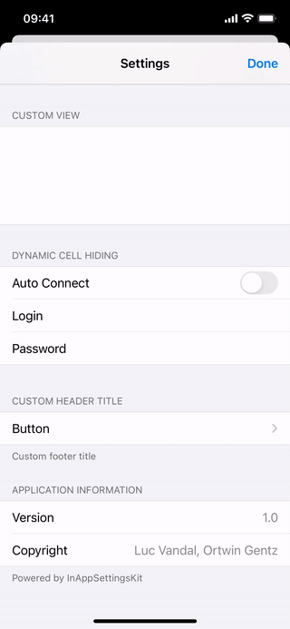

# InAppSettingsKit

[](https://travis-ci.org/futuretap/InAppSettingsKit)
[](http://cocoapods.org/pods/InAppSettingsKit)
[](https://swiftpackageindex.com/futuretap/InAppSettingsKit)
[](https://github.com/Carthage/Carthage)
[](https://github.com/futuretap/InAppSettingsKit/blob/master/LICENSE)

[](https://github.com/sponsors/futuretap)
[](https://twitter.com/ortwingentz)

InAppSettingsKit (IASK) is an open source framework to easily add in-app settings to your iOS or Catalyst apps. Normally iOS apps use the `Settings.bundle` resource to add app-specific settings in the Settings app. InAppSettingsKit takes advantage of the same bundle and allows you to present the same settings screen within your app. So the user has the choice where to change the settings.

IASK not only replicates the feature set of system settings but supports a large number of additional elements and configuration options.

**Updating from IASK 2.x?** Please read the [Release Notes](RELEASE_NOTES.md).



- [How does it work?](#how-does-it-work)
- [How to include it?](#how-to-include-it)
- [App Integration](#app-integration)
- [Goodies](#goodies)
	- [Custom inApp plists](#custom-inapp-plists)
	- [Privacy link](#privacy-link)
	- [Open URL](#open-url)
	- [Mail Composer](#mail-composer)
	- [Button](#button)
	- [Multiline Text View](#multiline-text-view)
	- [Date Picker](#date-picker)
	- [List Groups](#list-groups)
	- [Custom Views](#custom-views)
	- [Section Headers and Footers](#section-headers-and-footers)
	- [Extending Child Panes](#extending-child-panes)
	- [Extending various specifiers](#extending-various-specifiers)
	- [Extending Text Fields](#extending-text-fields)
	- [Customizing Toggles](#customizing-toggles)
	- [Dynamic MultiValue Lists](#dynamic-multivalue-lists)
	- [Settings Storage](#settings-storage)
	- [Notifications](#notifications)
	- [Dynamic cell hiding](#dynamic-cell-hiding)
	- [Register default values](#register-default-values)
- [iCloud sync](#icloud-sync)
- [Support](#support)
- [License](#license)
- [Author](#author)
    

# How does it work?

To support traditional Settings.app panes, the app must include a `Settings.bundle` with at least a `Root.plist` to specify the connection of settings UI elements with `NSUserDefaults` keys. InAppSettingsKit basically just uses the same Settings.bundle to do its work. This means there's no additional work when you want to include a new settings parameter. It just has to be added to the Settings.bundle and it will appear both in-app and in Settings.app. All settings types like text fields, sliders, toggle elements, child views etc. are supported.


# How to include it?

The source code is available on [github](http://github.com/futuretap/InAppSettingsKit). There are several ways of installing it:

**Using SPM**

Add to your Package.swift

    .package(name: "InAppSettingsKit", url: "https://github.com/futuretap/InAppSettingsKit.git", .branch("master"))

Alternatively go to Xcodes `File->Swift Packages->Add Package Dependency...` menu entry and add `https://github.com/futuretap/InAppSettingsKit.git`.

**Using CocoaPods**

Add to your `Podfile`:

    pod 'InAppSettingsKit'

**Using Carthage**

Add to your `Cartfile`:

    github "futuretap/InAppSettingsKit" "master"

# App Integration

In order to start using IASK add `Settings.bundle` to your project (`File` -> `Add File` -> `Settings bundle`) and edit `Root.plist` with your settings (see Apple's documentation on the [Schema File Root Content](https://developer.apple.com/library/ios/documentation/Cocoa/Conceptual/UserDefaults/Preferences/Preferences.html)). Read on to get insight into more advanced uses.

To display InAppSettingsKit, instantiate `IASKAppSettingsViewController` and push it onto the navigation stack or embed it as the root view controller of a navigation controller.

**In code, using Swift:**
```swift
let appSettingsViewController = IASKAppSettingsViewController()
navigationController.pushViewController(appSettingsViewController, animated: true)
```

**In code, using Objective-C:**
```objc
IASKAppSettingsViewController *appSettingsViewController = [[IASKAppSettingsViewController alloc] init];
[self.navigationController pushViewController:appSettingsViewController animated:YES];
```

**Via storyboard:**

- Drag and drop a Table View Controller embedded into a Navigation Controller into your app and wire the storyboard to your app UI
- Set the Table View Controller class to `IASKAppSettingsViewController`
- Set the Table View to "Grouped" style.
- If you’re presenting the navigation controller modally: 
	- In the Table View Controller set "Show Done Button" under "App Settings View Controller" to "On"
	- Set the delegate comforming to `IASKAppSettingsViewControllerDelegate`.
	- Implement the delegate method `-settingsViewControllerDidEnd:` and dismiss the view controller.

The sample application shows how to wire everything up.

**Additional changes**

To customize the behavior, implement `IASKSettingsDelegate` and set the `delegate` property of `IASKAppSettingsViewController`. For advanced customization needs, subclassing of IASKAppSettingsViewController is supported.

Depending on your project it might be needed to make some changes in the startup code of your app. Your app has to be able to reconfigure itself at runtime if the settings are changed by the user. This could be done in a `-reconfigure` method that is being called from `-applicationDidFinishLaunching` as well as in the delegate method `-settingsViewControllerDidEnd:` of `IASKAppSettingsViewController`.


# Goodies
The intention of InAppSettingsKit was to create a 100% imitation of the Settings.app behavior (see the [Apple Settings Application Schema Reference](https://developer.apple.com/library/archive/documentation/PreferenceSettings/Conceptual/SettingsApplicationSchemaReference/Introduction/Introduction.html#//apple_ref/doc/uid/TP40007071)). On top of that, we added a ton of bonus features that make IASK much more flexible and dynamic.


## Custom inApp plists
Settings plists can be device-dependent: `Root~ipad.plist` will be used on iPad and `Root~iphone.plist` on iPhone. If not existent, `Root.plist` will be used.

InAppSettingsKit adds the possibility to override those standard files by using `.inApp.plist` instead of `.plist`. Alternatively, you can create a totally separate bundle named `InAppSettings.bundle` instead of the usual `Settings.bundle`. The latter approach is useful if you want to suppress the settings in Settings.app.

This is the complete search order for the plists:

- InAppSettings.bundle/FILE~DEVICE.inApp.plist
- InAppSettings.bundle/FILE.inApp.plist
- InAppSettings.bundle/FILE~DEVICE.plist
- InAppSettings.bundle/FILE.plist
- Settings.bundle/FILE~DEVICE.inApp.plist
- Settings.bundle/FILE.inApp.plist
- Settings.bundle/FILE~DEVICE.plist
- Settings.bundle/FILE.plist


## Privacy link
If the app includes a usage key for various privacy features such as camera or location access in its `Info.plist`, IASK displays a "Privacy" cell at the top of the root settings page. This cell opens the system Settings app and displays the settings pane for the app where the user can specify the privacy settings for the app.

If you don't want to show Privacy cells, set the property `neverShowPrivacySettings` to `YES`.

The sample app defines `NSMicrophoneUsageDescription` to let the cell appear. Note that the settings page doesn't show any privacy settings yet because the app doesn't actually access the microphone. Privacy settings only show up in the Settings app after first use of the privacy-protected API.


## Open URL
InAppSettingsKit adds a new element `IASKOpenURLSpecifier` that allows to open a specified URL using an external application (i.e. Safari or Mail). The URL to launch is specified in the `File` parameter. See the sample `Root.inApp.plist` for details.


## Mail Composer
The custom `IASKMailComposeSpecifier` element allows to send mail from within the app by opening a mail compose view. You can set the following (optional) parameters using the settings plist: `IASKMailComposeToRecipents`, `IASKMailComposeCcRecipents`, `IASKMailComposeBccRecipents`, `IASKMailComposeSubject`, `IASKMailComposeBody`, `IASKMailComposeBodyIsHTML`. Optionally, you can implement

    - (BOOL)settingsViewController:(id<IASKViewController>)settingsViewController shouldPresentMailComposeViewController:(MFMailComposeViewController*)mailComposeViewController forSpecifier:(IASKSpecifier*)specifier;

in your delegate to customize the mail (e.g. pre-fill the body with dynamic content, add attachments) modify the appearance of the compose view controller or even block the standard presentation. An alert is displayed if Email is not configured on the device. `IASKSpecifier` is the internal model object defining a single settings cell. Important IASKSpecifier properties:

- `key`: corresponds to the `Key` in the Settings plist
- `title`: the localized title of settings key
- `type`: corresponds to the `Type` in the Settings plist
- `defaultValue`: corresponds to the `DefaultValue` in the Settings plist


## Button
InAppSettingsKit adds a `IASKButtonSpecifier` element that allows to call a custom action. Just add the following delegate method:

    - (void)settingsViewController:(IASKAppSettingsViewController*)sender buttonTappedForSpecifier:(IASKSpecifier*)specifier;

The sender is always an instance of `IASKAppSettingsViewController`, a `UIViewController` subclass. So you can access its view property (might be handy to display an action sheet) or push another view controller. Another nifty feature is that the title of IASK buttons can be overriden by the (localizable) value from `NSUserDefaults` (or any other settings store - see below). This comes in handy for toggle buttons (e.g. Login/Logout). See the sample app for details.

By default, Buttons are aligned centered except if an image is specified (default: left-aligned). The default alignment may be overridden.


## Multiline Text View
Similar to standard text fields, `IASKTextViewSpecifier` displays a full-width, multi line text view that resizes according to the entered text. It also supports `KeyboardType`, `AutocapitalizationType` and `AutocorrectionType`.


## Date Picker
`IASKDatePickerSpecifier` displays a `UIDatePicker` to set a date and/or time. It supports the following options:

 - `DatePickerMode`: one of `Date`, `Time`, or `DateAndTime` (see [UIDatePickerMode](https://developer.apple.com/documentation/uikit/uidatepickermode)). Default is `DateAndTime`.
 - `DatePickerStyle`: one of `Compact`, `Wheels`, or `Inline` (see [UIDatePickerStyle](https://developer.apple.com/documentation/uikit/uidatepickerstyle)). Default is `Wheels`. Feature requires iOS 14 or higher. If the OS doesn't support it, IASK falls back to `Wheels`.
 - `MinuteInterval`: The interval at which the date picker displays minutes. Default: 1.

There are 3 optional delegate methods to customize how to store and display dates and times:

    - (NSDate*)settingsViewController:(IASKAppSettingsViewController*)sender dateForSpecifier:(IASKSpecifier*)specifier;

Implement this if you store the date/time in a custom format other than as `NSDate` object. Called when the user starts editing a date/time by selecting the title cell above the date/time picker.

    - (NSString*)settingsViewController:(IASKAppSettingsViewController*)sender datePickerTitleForSpecifier:(IASKSpecifier*)specifier;
    
Implement this to customize the displayed value in the title cell above the date/time picker.

    - (void)settingsViewController:(IASKAppSettingsViewController*)sender setDate:(NSDate*)date forSpecifier:(IASKSpecifier*)specifier;

Implement this if you store the date/time in a custom format other than an `NSDate` object. Called when the user changes the date/time value using the picker.


## List Groups
List groups (`IASKListGroupSpecifier`) are an IASK-only feature that allow you to manage a variable number of items, including adding and deleting items. Arrays of tags, accounts, names are typical use cases. A list group consists of a variable number of `ItemSpecifier` items. The number of these items is determined by your actual content in your NSUserDefaults (or your custom settings store). In other words, `ItemSpecifier` defines the type of cell, whereas the number of cells and their content comes from NSUserDefaults or your store. Cells can be deleted via swipe if the `Deletable` parameter is set to YES.

Optionally, a list group also has an `AddSpecifier` that controls the last item of the list group section. It is used to add items and could be a text field, a toggle, a slider, or a child pane. While the first three create a new item after editing is complete, a child pane presents a modal child view controller to configure a complex item, saved as a dictionary. Such child panes work very similarly to normal child panes with a few differences: They are presented not via push but modally and have a Cancel and Done button in the navigation bar. A new item is created by tapping the Done button.

You may want to specify some validation rules that need to be met before enabling the Done button. This can be achieved with the delegate method:

    - (BOOL)settingsViewController:childPaneIsValidForSpecifier:contentDictionary:

The Done button is disabled when returning false from this method. Also note that the `contentDictionary` is a mutable dictionary. If you change some of the values, the UI will reflect that. This allows you to autocorrect invalid settings.


## Custom Views
You can specify your own `UITableViewCell` within InAppSettingsKit by using the type `IASKCustomViewSpecifier`. A mandatory field in this case is the `Key` attribute. Also, you have to support the `IASKSettingsDelegate` protocol and implement these methods:

    - (CGFloat)settingsViewController:(UITableViewController<IASKViewController> *)settingsViewController heightForSpecifier:(IASKSpecifier *)specifier;
    - (UITableViewCell*)settingsViewController:(UITableViewController<IASKViewController> *)settingsViewController cellForSpecifier:(IASKSpecifier*)specifier;

Both methods are called for all your `IASKCustomViewSpecifier` entries. To differentiate them, you can access the `Key` attribute using `specifier.key`. In the first method you return the height of the cell, in the second method the cell itself. You should use reusable `UITableViewCell` objects as usual in table view programming. There's an example in the Demo app.

Optionally you can implement

    - (void)settingsViewController:(IASKAppSettingsViewController*)settingsViewController
   didSelectCustomViewSpecifier:(IASKSpecifier*)specifier;

to catch tap events for your custom view.

If you specify `File`,  `IASKViewControllerClass`, `IASKViewControllerStoryBoardId`, or `IASKSegueIdentifier` (see below), the selection behavior of a custom view is identical to a child pane and the delegate is not called on selection.


## Section Headers and Footers
The FooterText key for Group elements is available in system settings. It is supported in InAppSettingsKit as well. On top of that, we support this key for Multi Value elements as well. The footer text is displayed below the table of multi value options.

You can define a custom header view for `PSGroupSpecifier` segments by adding a `Key` attribute and implementing the following method in your `IASKSettingsDelegate`:
    
	- (UIView *)settingsViewController:(id<IASKViewController>)settingsViewController tableView:(UITableView *)tableView viewForHeaderForSection:(NSInteger)section;

You can adjust the height of the header by implementing the following method:

	- (CGFloat)settingsViewController:(id<IASKViewController>)settingsViewController tableView:(UITableView*)tableView heightForHeaderForSection:(NSInteger)section;

For simpler header title customization without the need for a custom view, and provided the `-settingsViewController:tableView:viewForHeaderForSection:` method has not been implemented or returns `nil` for the section, implement the following method:

	- (NSString *)settingsViewController:(id<IASKViewController>)settingsViewController tableView:(UITableView*)tableView titleForHeaderForSection:(NSInteger)section;

If the method returns `nil` or a 0-length string, the title defined in the `.plist` will be used.

This behaviour is similar to custom table view cells. When implementing a method and if you need it, the section key can be retrieved from its index conveniently with:

	NSString *key = [settingsViewController.settingsReader keyForSection:section];

Check the demo app for a concrete example.

For footer customization, three methods from the `IASKSettingsDelegate` protocol can be similarly implemented.


## Extending Child Panes

### Custom ViewControllers
For child pane elements (`PSChildPaneSpecifier`), Apple requires a `file` key that specifies the child plist. InAppSettingsKit allow to alternatively specify `IASKViewControllerClass` and `IASKViewControllerSelector`. In this case, the child pane is displayed by instantiating a UIViewController subclass of the specified class and initializing it using the init method specified in the `IASKViewControllerSelector`. The selector must have two arguments: an `NSString` argument for the file name in the Settings bundle and the `IASKSpecifier`. The custom view controller is then pushed onto the navigation stack. See the sample app for more details.

### Using Custom ViewControllers from StoryBoard
Alternatively specify `IASKViewControllerStoryBoardId` to initiate a viewcontroller from [main storyboard](https://developer.apple.com/library/ios/documentation/general/conceptual/Devpedia-CocoaApp/Storyboard.html/).
Specify `IASKViewControllerStoryBoardFile` to use a storyboard other than the main storyboard from the app’s `Info.plist`.

### Perform Segues
As an alternative to `IASKViewControllerClass` and `IASKViewControllerSelector` for child pane elements (`PSChildPaneSpecifier`), InAppSettingsKit is able to navigate to another view controller, by performing any segue defined in your storyboard. To do so specify the segue identifier in `IASKSegueIdentifier`.


## Extending various specifiers

### Subtitles
The `IASKSubtitle` key allows to define subtitles for these elements: Toggle, ChildPane, OpenURL, MailCompose, Button. Using a subtitle implies left alignment.
A child pane displays its value as a subtitle, if available and no `IASKSubtitle` is specified.
The subtitle can be a localizable String or a Dictionary with localizable subtitles depending on the current value. `YES` and `NO` are used as keys for boolean toggle values. The dictionary may contain a `__default__` key to define a subtitle if no key is matching.

### Text alignment
For some element types, a `IASKTextAlignment` attribute may be added with the following values to override the default alignment:

- `IASKUITextAlignmentLeft` (ChildPane, TextField, Buttons, OpenURL, MailCompose)
- `IASKUITextAlignmentCenter` (ChildPane, Buttons, OpenURL)
- `IASKUITextAlignmentRight` (ChildPane, TextField, Buttons, OpenURL, MailCompose)

### Variable font size
By default, the labels in the settings table are displayed in a variable font size, especially handy to squeeze-in long localizations (beware: this might break the look in Settings.app if labels are too long!).
To disable this behavior, add a `IASKAdjustsFontSizeToFitWidth` Boolean attribute with value `NO`.

### Icons
All element types (except sliders which already have a `MinimumValueImage`) support an icon image on the left side of the cell. You can specify the image name in an optional `IASKCellImage` attribute. The ".png" or "@2x.png" suffix is automatically appended and will be searched in the project. Optionally, you can add an image with suffix "Highlighted.png" or "Highlighted@2x.png" to the project and it will be automatically used as a highlight image when the cell is selected (for Buttons and ChildPanes).


## Extending Text Fields
### Placeholder
The `IASKPlaceholder` key allows to define placeholder for TextField and TextView (`IASKTextViewSpecifier`).

### Content Type
To support autofill based on the content type, add the `IASKTextContentType` key accepting the (prefix-less) constant names of [UITextContentType](https://developer.apple.com/documentation/uikit/uitextcontenttype). 
Example: to configure a text field with `UITextContentTypeEmailAddress`, use `IASKTextContentType`: `EmailAddress`.

### Validation
Text fields can be validated using the delegate callback:

	- (IASKValidationResult)settingsViewController:(IASKAppSettingsViewController*)settingsViewController validateSpecifier:(IASKSpecifier*)specifier textField:(IASKTextField*)textField previousValue:(nullable NSString*)previousValue replacement:(NSString* _Nonnull __autoreleasing *_Nullable)replacement;

The callback receives the `IASKTextField` which is a `UITextField` subclass to allow styling of the text field in case of a validation error (e.g. red text). It contains a replacement out parameter to replace invalid text. Returning `IASKValidationResultFailedWithShake` lets the text field shake to visually indicate the validation error.


## Customizing Toggles
`PSToggleSwitchSpecifier` switches use a `UISwitch` by default. By specifying the option `IASKToggleStyle`: `Checkmark`, checkmarks are displayed for selected keys.


## Dynamic MultiValue Lists
MultiValue lists (`PSMultiValueSpecifier`) can fetch their values and titles dynamically from the delegate instead of the static Plist. Implement these two methods in your `IASKSettingsDelegate`:

    - (NSArray*)settingsViewController:(IASKAppSettingsViewController*)sender valuesForSpecifier:(IASKSpecifier*)specifier;
    - (NSArray*)settingsViewController:(IASKAppSettingsViewController*)sender titlesForSpecifier:(IASKSpecifier*)specifier;

The sample app returns a list of all country codes as values and the localized country names as titles.

MultiValue lists can be sorted alphabetically by adding a `true` Boolean `DisplaySortedByTitle` key in the Plist.
MultiValue list entries can be given an image. Specify images via the `IconNames` attribute (next to Values/Titles/ShortTitles etc.).


## Settings Storage
The default behaviour of IASK is to store the settings in `[NSUserDefaults standardUserDefaults]`. However, it is possible to change this behavior by setting the `settingsStore` property on an `IASKAppSettingsViewController`. IASK comes with two store implementations: `IASKSettingsStoreUserDefaults` (the default one) and `IASKSettingsStoreFile`, which read and write the settings in a file of the path you choose. If you need something more specific, you can also choose to create your own store. The easiest way to create your own store is to create a subclass of `IASKAbstractSettingsStore`. Only 3 methods are required to override. See `IASKSettingsStore.{h,m}` for more details.


## Notifications
There's a `IASKSettingChangedNotification` notification that is sent for every changed settings key. The `object` of the notification is the sending view controller and the `userInfo` dictionary contains the key and new value of the affected key.


## Dynamic cell hiding
Sometimes, options depend on each other. For instance, you might want to have an "Auto Connect" switch, and let the user set username and password if enabled. To react on changes of a specific setting, use the `IASKSettingChangedNotification` notification explained above.

To hide a set of cells use:

    - (void)[IASKAppSettingsViewController setHiddenKeys:(NSSet*)hiddenKeys animated:(BOOL)animated];

or the non-animated version:

	@property (nonatomic, strong) NSSet *hiddenKeys;

See the sample app for more details. Including a `PSGroupSpecifier` key in the `hiddenKeys` hides the complete section.


## Register default values
Settings property lists support the `DefaultValue` parameter to display default values in case there’s no value stored in `NSUserDefaults`. However, when the app queries `NSUserDefaults` for the value, that default value is not propagated. This makes sense since `NSUserDefaults` doesn’t know about settings property lists.

To initially set values for the various settings keys, `NSUserDefaults` provides the `registerDefaults:` method that takes a dictionary of "fallback" values that are returned from `NSUserDefaults` if no value has been stored. This is typically called at app launch.

However, creating and maintaining that dictionary can be cumbersome and there’s a risk that this dictionary and the settings default values get out of sync.

To address this, `IASKSettingsReader` provides a method that generates this dictionary by traversing the Root.plist and all child plists and gathering the `DefaultValue` for all keys.

    NSDictionary *defaultDict = [appSettingsViewController.settingsReader gatherDefaultsLimitedToEditableFields:YES];
    [NSUserDefaults.standardUserDefaults registerDefaults:defaultDict];


# iCloud sync
To sync your `NSUserDefaults` with iCloud, there's another project called [FTiCloudSync](https://github.com/futuretap/FTiCloudSync) which is implemented as a category on `NSUserDefaults`: All write and remove requests are automatically forwarded to iCloud and all updates from iCloud are automatically stored in `NSUserDefaults`. InAppSettingsKit automatically updates the UI if the standard `NSUserDefaults` based store is used.

# Support
Please don't use Github issues for support requests, we'll close them. Instead, post your question on [StackOverflow](http://stackoverflow.com) with tag `inappsettingskit`.


# License
We released the code under the liberal BSD license in order to make it possible to include it in every project, be it a free or paid app. The only thing we ask for is giving the original developers some credit. The easiest way to include credits is by leaving the "Powered by InAppSettingsKit" notice in the code. If you decide to remove this notice, a noticeable mention on the App Store description page or homepage is fine, too.

# Author
Originally developed by my friend Luc Vandal, I took over the development and continue to update the framework. If you would like to support my Open Source work, consider joining me as a [sponsor](https://github.com/sponsors/futuretap)! 💪️ Your sponsorship enables me to spend more time on InAppSettingsKit and other community projects. Thank you!

*Ortwin Gentz*
